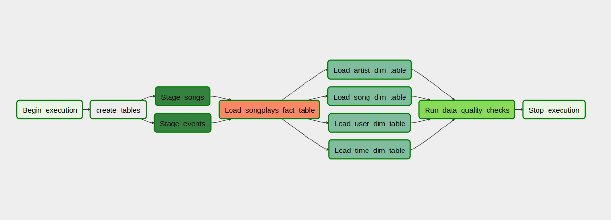

## Project description:
In this project, we build an ETL pipeline on cloud using AWS Redshift and orchestrated via Apache Airflow. We model our data as a star-schema dimensional model. The data consists of listening event logs from a music app Sparkify and data about songs, artists, and users.
The process looks like the following:
1. First we stage the logs from S3 to staging tables in Redshift using a custom Airflow Operator
2. Next we move data from staging tables to our star schema tables using PostgresOperator
3. Finally we do some Data quality checks on our tables using custom Airflow operator

The DW schema looks like the following:

The Airflow pipeline looks like the following:

## Installation instructions:
Following installation instructions from:
https://airflow.readthedocs.io/en/latest/installation.html
Prerequisites:
On Debian based Linux OS:

sudo apt-get update
sudo apt-get install build-essential

Installing just airflow

pip install \
 apache-airflow==1.10.10 \
 --constraint \
        https://raw.githubusercontent.com/apache/airflow/1.10.10/requirements/requirements-python3.6.txt

Verified with: `airflow version` that 1.10.10 is installed

## Run instructions:
Copy the dags and operators to ~/airflow/dags and ~/airflow/plugins or wherever your airflow home directory is located.
In this repo, this is done via the copy_dags.sh script. This should be run from current directory.

Then, initialize meta-db to store airflow dag runs info:
Run `airflow initdb` (note official doc says: `airflow db init` which is not a valid command)
Run `airflow webserver` to start the airflow UI and `airflow scheduler` to run the scheduler to run the pipeline.
